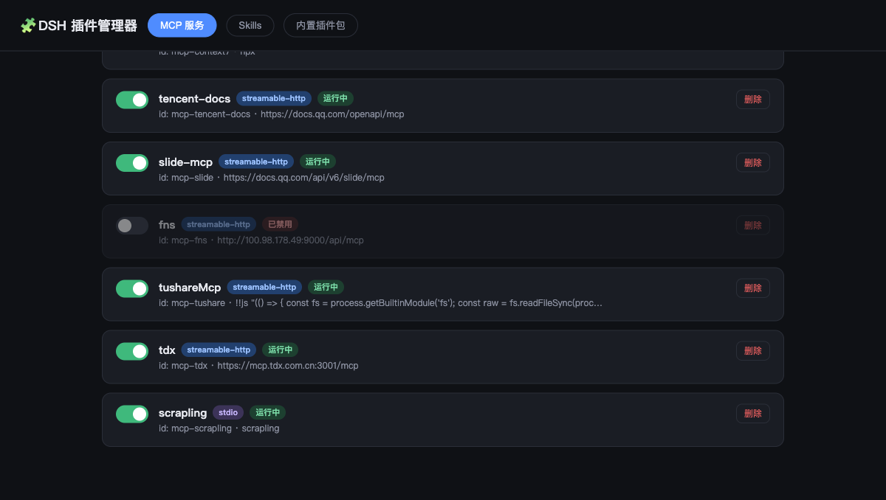
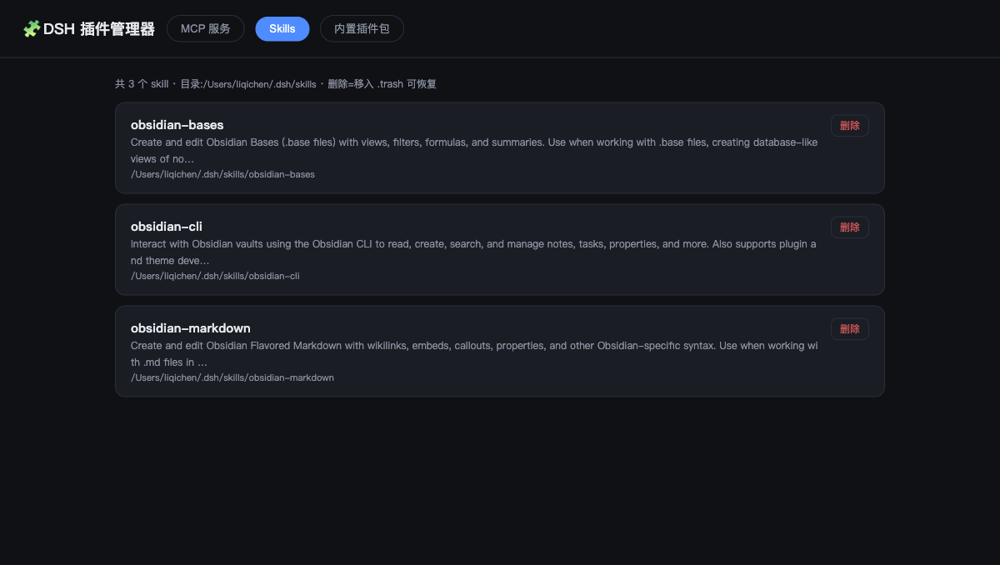
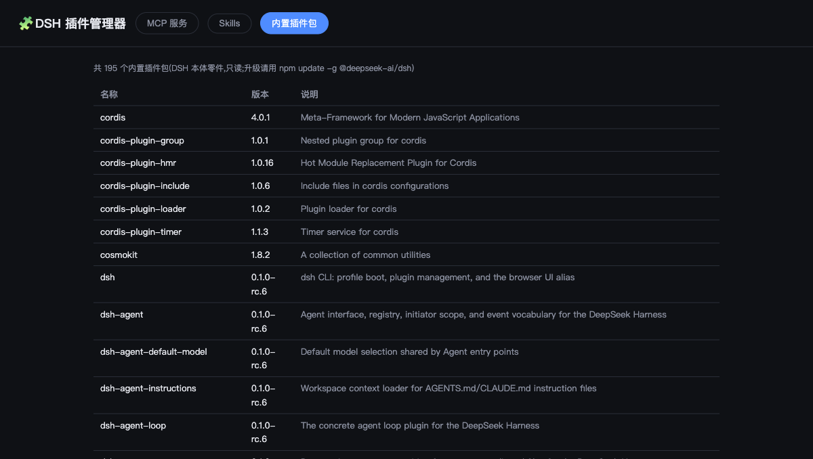

# DSH 插件管理器 (dsh-plugin-manager)

在 **DeepSeek Harness (DSH)** 的 Web 设置面板里内嵌一个「插件管理」页,用图形界面管理:

- **MCP 服务** — 开关(禁用/启用)、删除
- **Skills** — 浏览、删除(移入 `.trash-*`,可恢复)
- **内置插件包** — 只读浏览 DSH 本体的 160+ 插件包信息

所有操作**实时热生效**,不需要重启 dsh web。





---

## 功能特性

| 功能 | 说明 |
|---|---|
| MCP 开关 | 在 `cordis.patch.yml` 对应条目下插入/移除 `disabled: true`,宿主 HMR 监听 patch 文件,实时热生效 |
| MCP 删除 | 从配置文件中删除整个 MCP 条目(条目上方的注释行保留) |
| Skill 删除 | **不真正删除**,移动目录到 `~/.dsh/skills/.trash-<时间戳>-<名称>`,可手动恢复 |
| 内置插件包 | 只读列表(DSH 本体零件),升级请用 `npm update -g @deepseek-ai/dsh` |
| 自动备份 | 每次写操作前自动备份 `cordis.patch.yml` 为 `cordis.patch.yml.bak-<时间戳>` |

## 工作原理

本插件由两部分组成,作为标准 DSH 双端插件随 dsh web 一同启动:

```
┌─────────────────────────── dsh web 宿主 ───────────────────────────┐
│                                                                     │
│  浏览器端 (client.js)                 Node 端 (index.js)            │
│  ┌───────────────────────┐            ┌─────────────────────────┐  │
│  │ 设置面板「插件管理」页 │  fetch     │ 注册 /plugin-manager/   │  │
│  │ React UI · 同源 API   │ ─────────▶ │ api/* 路由(内嵌后端)     │  │
│  └───────────────────────┘            │ 读取/修改:              │  │
│                                       │  · ~/.dsh/profiles/web/ │  │
│                                       │    cordis.patch.yml     │  │
│                                       │  · ~/.dsh/skills/       │  │
│                                       │  · ~/.dsh/profiles/     │  │
│                                       │    node_modules/@deep-  │  │
│                                       │    seek-ai/             │  │
│                                       └─────────────────────────┘  │
└────────────────────────────────────────────────────────────────────┘
```

### API

| 方法 | 路径 | 说明 |
|---|---|---|
| GET | `/plugin-manager/api/state` | 返回 `{ mcp, skills, plugins, patchFile, skillsDir }` |
| POST | `/plugin-manager/api/action` | `{ kind: "mcp-toggle", id, disable }` / `{ kind: "mcp-delete", id }` / `{ kind: "skill-delete", name }` |

所有写操作:先 `backup()`(复制一份 `.bak-时间戳`),再改文件。

## 安装

> 前提:已安装 DSH(dsh web),熟悉 `~/.dsh` 目录结构。

```bash
# 1. 把插件放到用户插件目录
mkdir -p ~/.dsh/plugins/dsh-plugin-manager
cp index.js client.js package.json ~/.dsh/plugins/dsh-plugin-manager/

# 2. 通过 dsh CLI 注册插件
dsh plugin --profile web add ~/.dsh/plugins/dsh-plugin-manager

# 3. 在 profile 的 package.json 里声明依赖(让 Node 端可解析)
#    编辑 ~/.dsh/profiles/web/package.json,dependencies 加入:
#    "dsh-plugin-manager": "file:../../plugins/dsh-plugin-manager"

# 4. 在 cordis.patch.yml 的 plugins 列表加入 Node 端条目(名字须与包名一致):
#    - id: plugin-manager-ui
#      name: dsh-plugin-manager

# 5. 重启 dsh web,打开「设置」→「插件管理」
```

### 双端解析说明(排错必读)

DSH 双端插件(客户端 UI 插件)需要**两个入口都能被解析**:

- **浏览器端**:`dsh` 包元数据里的 `dsh.client.inject` 声明了依赖的宿主模块
  (`@deepseek-ai/dsh-client-runtime`、`dsh-client-locale`、`dsh-client-ui-settings`),
  由 dsh 客户端的插件扫描机制发现,`client.js` 通过 `window.__ModuleLoader__.load()` 注册。
- **Node 端**:`index.js` 导出 `name` + `inject: ["webServer"]`,在 `cordis.patch.yml`
  的 plugins 列表里声明后,由宿主 cordis 加载,负责注册 `/plugin-manager/api/*` 路由。

如果浏览器端报「插件后端未响应」,先检查第 3、4 步是否都做了、以及
`~/.dsh/profiles/node_modules/dsh-plugin-manager` 是否指向插件目录。

## 注意事项(重要)

1. **写的是你的真实配置**:所有操作直接修改 `~/.dsh/profiles/web/cordis.patch.yml`
   和 `~/.dsh/skills/`。每次修改前会自动备份,但请勿把备份文件当保险箱——
   出问题可以手动用最近的 `.bak-*` 恢复。
2. **MCP 删除 ≠ 卸载包**:`mcp-delete` 只把条目从 `cordis.patch.yml` 删掉,
   MCP 的 npm 包本身还在,重新加回配置即可恢复。
3. **Skill 删除可恢复**:删除是「移入 `.trash-*`」,想彻底删除请手动删掉对应目录。
4. **内置插件包页是只读的**:不会、也不能从这里卸载 DSH 本体组件。
5. **热生效范围**:开关/删除 MCP 会实时生效,但**已打开的会话**里工具列表不会自动刷新,
   建议开新会话以加载最新的 MCP 工具列表。
6. **默认绑定本机**:API 由 dsh web 宿主同源提供,不额外开端口,无跨域暴露。

## 遗留版本:独立 Python 服务

最早一版是独立的本地网页服务(不依赖 dsh 插件系统),保留在 [`legacy/server.py`](legacy/server.py):

```bash
python3 legacy/server.py --port 17891
# 浏览器打开 http://127.0.0.1:17891/
```

它通过 CORS 让任意网页调用,功能与内嵌版相同,适合在 dsh 插件机制不适用时临时使用。

## 许可证

[MIT](LICENSE)
